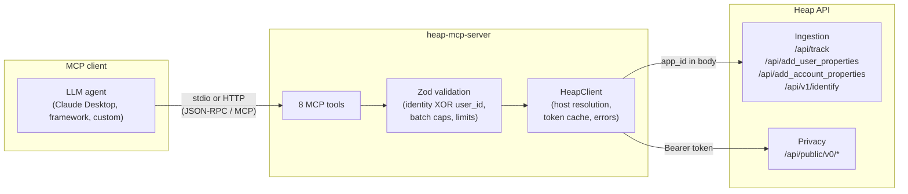
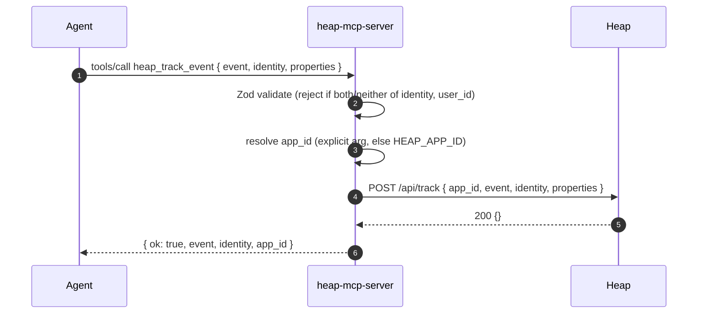
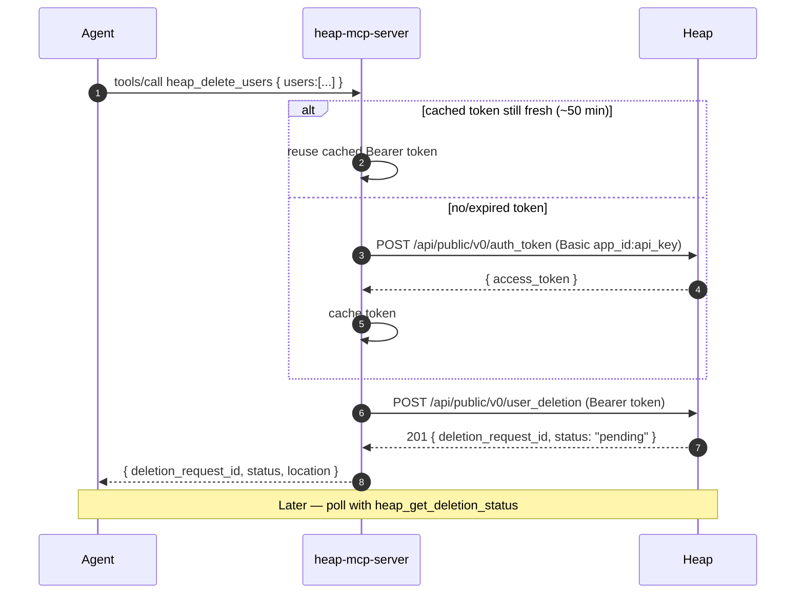

# Heap Analytics MCP Server

> A [Model Context Protocol](https://modelcontextprotocol.io) server that lets AI agents send events, enrich user/account profiles, resolve identities, and run GDPR deletions against [Heap Analytics](https://heap.io) (heap.io).

<p>
  
  
  
  
  
  
</p>

`heap-mcp-server` exposes Heap's **server-side API** as a set of MCP tools. Point any MCP-compatible client (Claude Desktop, an agent framework, your own code) at it, and the model can log custom events, attach user and account properties, unify identities, and process user-deletion requests — all with validated inputs and actionable errors.

---

## Contents

- [Why use this](#why-use-this)
- [Scope: what it can and cannot do](#scope-what-it-can-and-cannot-do)
- [Capabilities](#capabilities)
- [How it works](#how-it-works)
- [Requirements](#requirements)
- [Quick start](#quick-start)
- [Configuration](#configuration)
- [Usage](#usage)
- [Examples](#examples)
- [Rate limits](#rate-limits)
- [Error handling](#error-handling)
- [Security considerations](#security-considerations)
- [Project structure](#project-structure)
- [Development](#development)
- [Staying current with the Heap API](#staying-current-with-the-heap-api)
- [Publishing](#publishing)
- [Roadmap](#roadmap)
- [Contributing](#contributing)
- [License](#license)
- [Disclaimer](#disclaimer)

---

## Why use this

- **Write to Heap from anywhere an agent runs.** Backfill events, enrich profiles, or run deletions through natural-language tool calls instead of hand-rolling HTTP requests.
- **Guardrails built in.** Heap's rules (one of `identity`/`user_id`, batch caps, identity-length limits) are enforced *before* any network call, so mistakes fail fast with clear messages.
- **Both transports.** Run locally over stdio for desktop clients, or as a stateless streamable-HTTP service for remote/multi-client use.
- **US & EU datacenters**, plus an optional base-URL override for proxies and gateways.

## Scope: what it can and cannot do

Heap's **public API is write-oriented.** There is no public REST query or reporting endpoint — Heap's data-*out* happens through [Heap Connect](https://help.heap.io) (a data-warehouse sync), not an API. So this server covers ingestion, enrichment, identity, and privacy operations.

| You **can** | You **cannot** (no public API) |
|---|---|
| Send custom events (single + bulk) | Query events, sessions, or users |
| Set user properties (single + bulk) | Run funnels, retention, or reports |
| Set account properties (single + bulk) | Read back property values |
| Link anonymous `user_id` → `identity` | Export raw data (use Heap Connect) |
| Submit & poll GDPR user deletions | — |

If your goal is reading analytics, this server is not the right tool; you want Heap Connect into a warehouse. If your goal is *getting data into* Heap and managing identities/privacy, read on.

## Capabilities

Eight tools, grouped by domain. Every tool accepts an optional `response_format` (`markdown` default, or `json`) and an optional `app_id` that overrides the configured default.

| Tool | Heap endpoint | Auth | Annotation |
|------|---------------|------|------------|
| `heap_track_event` | `POST /api/track` | `app_id` | write |
| `heap_bulk_track_events` (≤1000) | `POST /api/track` | `app_id` | write |
| `heap_add_user_properties` | `POST /api/add_user_properties` | `app_id` | write, idempotent |
| `heap_bulk_add_user_properties` (≤1000) | `POST /api/add_user_properties` | `app_id` | write, idempotent |
| `heap_add_account_properties` (single or bulk) | `POST /api/add_account_properties` | `app_id` | write, idempotent |
| `heap_identify_user` | `POST /api/v1/identify` | `app_id` | write, idempotent |
| `heap_delete_users` (≤10000) | `POST /api/public/v0/user_deletion` | API key | **destructive** |
| `heap_get_deletion_status` | `GET /api/public/v0/deletion_status/:id` | API key | read-only |

<details>
<summary><strong>Per-tool argument reference</strong></summary>

### `heap_track_event`
Send one custom server-side event.
- `event` (string, required) — event name, ≤1024 chars.
- `identity` **or** `user_id` (exactly one, required).
- `properties` (object, optional) — string/number/boolean or arrays thereof.
- `session_id`, `timestamp` (ISO8601), `idempotency_key` (optional).

### `heap_bulk_track_events`
Same as above, but `events` is an array (1–1000), each item carrying its own identity/properties.

### `heap_add_user_properties`
- `identity` (string, required), `properties` (object, required).
- Use a lowercase `email` key to write Heap's built-in Email property.

### `heap_bulk_add_user_properties`
- `users` — array (1–1000) of `{ identity, properties }`.

### `heap_add_account_properties`
- Single: `account_id` + `properties`. **Or** bulk: `accounts` array of `{ account_id, properties }`. Not both.
- Requires the Account ID setting (or Salesforce integration) configured in Heap.

### `heap_identify_user`
- `user_id` (numeric string from the SDK) + `identity` (both required), optional `timestamp`.

### `heap_delete_users`
- `users` — array (1–10000), each identified by exactly one of `user_id` or `identity`.
- Returns `deletion_request_id`, `status`, `deletion_request_location`.

### `heap_get_deletion_status`
- `deletion_request_id` (string, required). Returns `status` = `pending` | `complete`.

</details>

## How it works

### Architecture



### Ingestion request lifecycle



### Deletion auth flow (Basic → cached Bearer)



## Requirements

- **Node.js ≥ 18**
- A **Heap account** with an environment (app) ID. An **API key** is needed only for the deletion tools.
- An **MCP client** (e.g. Claude Desktop), or the [MCP Inspector](https://github.com/modelcontextprotocol/inspector) for testing.

## Quick start

Once published to npm, the fastest path is `npx` (no clone, no build):

```bash
HEAP_APP_ID=your_app_id npx heap-mcp-server
```

Or run from source:

```bash
git clone https://github.com/rivit-studio/heap-mcp-server.git
cd heap-mcp-server
npm install
npm run build

# run over stdio with your Heap environment ID
HEAP_APP_ID=your_app_id node dist/index.js
```

Then register it with your client (see [Usage](#usage)).

> **Installing from npm:** `npm install -g heap-mcp-server` exposes the `heap-mcp-server` command; or add it as a project dependency and invoke via `npx heap-mcp-server`.

## Configuration

All configuration is via environment variables. Copy `.env.example` to `.env` as a starting point.

| Variable | Required | Default | Description |
|----------|----------|---------|-------------|
| `HEAP_APP_ID` | Recommended | — | Default environment (app) ID. Without it, every call must pass `app_id`. |
| `HEAP_API_KEY` | Deletion only | — | Enables the deletion tools. For deletion, `HEAP_APP_ID` must be your **Main Production** environment ID. |
| `HEAP_DATA_CENTER` | No | `us` | `us` or `eu`. EU routes ingestion through `c.eu.heap-api.com`. |
| `HEAP_BASE_URL` | No | — | Override the Heap host (proxy/gateway). Applies to all endpoints. |
| `TRANSPORT` | No | `stdio` | `stdio` or `http`. |
| `PORT` | No | `3000` | Port for the `http` transport. |

**Where to find these in Heap:**
- Environment ID → **Account › Manage › Projects**
- API key → **Account › Manage › Privacy & Security** (admins can generate one)

## Usage

### stdio (local desktop clients)

```bash
HEAP_APP_ID=your_app_id node dist/index.js
```

Claude Desktop config (`claude_desktop_config.json`):

```json
{
  "mcpServers": {
    "heap": {
      "command": "node",
      "args": ["/absolute/path/to/heap-mcp-server/dist/index.js"],
      "env": {
        "HEAP_APP_ID": "your_app_id",
        "HEAP_API_KEY": "only_if_using_deletion",
        "HEAP_DATA_CENTER": "us"
      }
    }
  }
}
```

### HTTP (remote / multiple clients)

```bash
HEAP_APP_ID=your_app_id TRANSPORT=http PORT=3000 node dist/index.js
```

- MCP endpoint: `POST http://localhost:3000/mcp`
- Health check: `GET http://localhost:3000/health`

The HTTP transport is **stateless** — a fresh server + transport is created per request, which avoids request-ID collisions and scales cleanly behind a load balancer.

### Docker (HTTP transport)

A multi-stage `Dockerfile` is included. The image builds the TypeScript, installs only production dependencies, runs as a non-root user, and ships with a `/health` healthcheck. It defaults to the HTTP transport.

```bash
docker build -t heap-mcp-server .

docker run --rm -p 3000:3000 \
  -e HEAP_APP_ID=your_app_id \
  -e HEAP_API_KEY=only_if_using_deletion \
  -e HEAP_DATA_CENTER=us \
  heap-mcp-server
```

- MCP endpoint: `POST http://localhost:3000/mcp`
- Health check: `GET http://localhost:3000/health`

> The HTTP transport ships without authentication — see [Security considerations](#security-considerations) before exposing the container beyond localhost.

### Inspect interactively

```bash
npx @modelcontextprotocol/inspector node dist/index.js
```

## Examples

These are natural-language prompts an agent might receive and the resulting tool call.

**Track a purchase**
> "Log a `Purchase` event for `alice@example.com` with amount 42 and plan pro."

```json
{
  "name": "heap_track_event",
  "arguments": {
    "event": "Purchase",
    "identity": "alice@example.com",
    "properties": { "amount": 42, "plan": "pro" }
  }
}
```

**Enrich an account for account-health analysis**
> "Set tier=Enterprise and mrr=12000 on account `Acme Corp`."

```json
{
  "name": "heap_add_account_properties",
  "arguments": {
    "account_id": "Acme Corp",
    "properties": { "tier": "Enterprise", "mrr": 12000 }
  }
}
```

**Unify an anonymous visitor with a known user**
> "Identify SDK user 1847839267195673 as bob@example.com."

```json
{
  "name": "heap_identify_user",
  "arguments": { "user_id": "1847839267195673", "identity": "bob@example.com" }
}
```

**Run a GDPR deletion, then check status**
> "Delete the Heap user gone@example.com, then tell me the request status."

```json
{ "name": "heap_delete_users", "arguments": { "users": [{ "identity": "gone@example.com" }] } }
```
```json
{ "name": "heap_get_deletion_status", "arguments": { "deletion_request_id": "c93fae81-..." } }
```

## Rate limits

Enforced by Heap (the server surfaces a clear message on `429`):

- **Single track / property calls:** 30 requests / 30 s per identity per `app_id`.
- **Bulk track:** 1000 events / min / identity and 15,000 events / min / `app_id`.
- **Identify:** 1 identity per `user_id`; up to 10 `user_id`s per identity per month. Excess mappings are silently dropped by Heap.

Prefer the bulk tools for backfills to stay within limits.

## Error handling

Failures are normalized into actionable messages with structured content, so an agent can react:

| Condition | What you get |
|---|---|
| Invalid input (e.g. both `identity` and `user_id`) | Validation error *before* any request, naming the exact rule |
| `400` from Heap | "Bad request… check required fields and identity/user_id" + Heap's detail |
| `401` | Hint to verify `HEAP_APP_ID` (Main Production) and `HEAP_API_KEY` |
| `404` (status lookup) | Hint that the `deletion_request_id` may not exist for this env |
| `429` | Rate-limit explanation with the relevant limits |
| Network / timeout | Connection guidance |

## Security considerations

- **Secrets live in env vars, never in code or logs.** The server logs only *whether* `HEAP_APP_ID`/`HEAP_API_KEY` are set, never their values.
- **The API key unlocks irreversible deletion.** Scope it tightly and prefer running deletion workflows in a controlled environment. `heap_delete_users` is annotated `destructive` so clients can gate it behind confirmation.
- **The HTTP transport ships without auth.** If you expose it beyond localhost, put it behind your own authentication/authorization (reverse proxy, gateway, network policy). Treat `/mcp` as privileged.
- **PII flows through this server.** Identities and properties may contain personal data; handle transport and hosting accordingly.

To report a vulnerability, see **[SECURITY.md](SECURITY.md)** — please use private disclosure, not a public issue.

## Project structure

```
heap-mcp-server/
├── src/
│   ├── index.ts               # entry point: transports + server wiring
│   ├── constants.ts           # datacenter hosts, limits, config resolution
│   ├── types.ts               # shared types
│   ├── schemas.ts             # Zod input schemas (validation rules)
│   ├── services/
│   │   └── heapClient.ts       # HTTP client, auth-token caching, error normalization
│   └── tools/
│       ├── tracking.ts         # heap_track_event, heap_bulk_track_events
│       ├── properties.ts       # user + account property tools
│       ├── identity.ts         # heap_identify_user
│       ├── deletion.ts         # heap_delete_users, heap_get_deletion_status
│       └── helpers.ts          # shared response builders
├── test/
│   ├── schemas.test.mjs        # unit tests for validation rules
│   └── integration.test.mjs    # mock-server integration tests
├── scripts/
│   └── check-heap-api.mjs      # Heap API drift checker
├── .heap-api-snapshots/        # committed baseline of Heap's OpenAPI specs
├── .github/
│   ├── workflows/
│   │   ├── ci.yml              # build + test (Node 18/20/22) and Docker build
│   │   ├── publish.yml         # npm publish on GitHub Release
│   │   └── heap-api-watch.yml  # scheduled Heap API drift check -> issue
│   ├── ISSUE_TEMPLATE/         # bug report, feature request, chooser config
│   ├── pull_request_template.md
│   └── dependabot.yml          # weekly npm / actions / docker updates
├── Dockerfile                  # multi-stage build, HTTP transport
├── .dockerignore
├── .gitignore
├── .env.example
├── CONTRIBUTING.md
├── SECURITY.md
├── LICENSE
├── package.json
├── tsconfig.json
└── README.md
```

## Development

```bash
npm install        # install deps
npm run build      # compile TypeScript -> dist/
npm run dev        # watch mode (tsx)
npm run clean      # remove dist/
npm start          # run the built server
npm test           # build, then run all tests
npm run check:heap-api  # check Heap's API for drift vs committed snapshots
```

The codebase is strict TypeScript (no `any`), with validation centralized in `schemas.ts` and all HTTP/auth/error logic in `services/heapClient.ts`. Tools stay thin and compose those.

### Testing

Tests use Node's built-in runner (`node:test`) — no extra framework or dependencies.

```bash
npm test           # builds first, then runs the suite
npm run test:only  # run tests against the existing build (skip rebuild)
```

- **Unit** (`test/schemas.test.mjs`) — assert the Zod schemas accept valid input and reject invalid input (identity/user_id rule, batch caps, strictness, length limits).
- **Integration** (`test/integration.test.mjs`) — start a local mock HTTP server, run the built server over stdio with `HEAP_BASE_URL` pointed at the mock, drive tools through the MCP protocol, and assert the exact requests Heap would receive (endpoints, bodies, and the Basic→Bearer auth flow plus token caching).

Because the integration tests point `HEAP_BASE_URL` at a local mock, they never touch a real Heap workspace and need no credentials.

**Continuous integration.** `.github/workflows/ci.yml` runs the build and test suite on Node 18, 20, and 22, and builds the Docker image, on every push and pull request to `main`.

## Staying current with the Heap API

Because this server mirrors Heap's server-side endpoints, it can fall out of date if Heap changes them. The repo guards against silent drift:

- **Snapshots.** `.heap-api-snapshots/` holds a committed baseline of the embedded OpenAPI definitions (and normalized text) for every Heap reference page the tools depend on.
- **Checker.** `npm run check:heap-api` re-fetches those pages, normalizes them, and diffs against the baseline. It exits non-zero and writes `heap-api-diff.md` if anything changed.
- **Scheduled watch.** `.github/workflows/heap-api-watch.yml` runs the checker every Monday (and on demand). On drift it opens — or comments on — an issue labeled `heap-api-drift` with the diff, so maintainers get notified without any external service.

When a change is real and intended, review the affected tools/schemas, then refresh the baseline:

```bash
npm run check:heap-api -- --update
git add .heap-api-snapshots && git commit -m "chore: refresh Heap API snapshots"
```

Dependencies are likewise kept current by **Dependabot** (`.github/dependabot.yml`) across npm, GitHub Actions, and the Dockerfile.

## Publishing

Releases publish to npm automatically via `.github/workflows/publish.yml` when a GitHub Release is published. Set an `NPM_TOKEN` repository secret (an npm automation token with publish rights) first. The workflow builds, tests, and runs `npm publish --provenance --access public`. Bump the version in `package.json` before tagging the release.

## Roadmap

Ideas and PRs welcome:

- [x] Automated test suite (unit + mock-server integration)
- [x] `Dockerfile` and container image for the HTTP transport
- [x] CI workflow (build + test on PRs)
- [x] npm publish workflow + `npx` entry point
- [x] Heap API drift monitoring
- [ ] Optional auth middleware for the HTTP transport
- [ ] MCP evaluation suite

## Contributing

Contributions are welcome — see **[CONTRIBUTING.md](CONTRIBUTING.md)** for setup, conventions, and the PR process. In short:

1. Open an issue describing the change or bug.
2. Fork, branch, and make your change. Keep tools thin; put shared logic in `services/` and validation in `schemas.ts`.
3. Run `npm test` (build + tests must pass) and verify behavior with the MCP Inspector.
4. Open a PR with a clear description and, where relevant, before/after notes.

Keep new tools consistent with the existing patterns: snake_case `heap_*` names, full descriptions with `Args:` / `Returns:` / `Example:`, correct annotations (`readOnlyHint`/`destructiveHint`/`idempotentHint`), and `.strict()` Zod schemas.

## License

Released under the **MIT License** — see [LICENSE](LICENSE). The license file ships with a placeholder copyright line (`<YOUR NAME OR ORGANIZATION>`); update it with your name/organization before publishing.

## Disclaimer

This is an **unofficial, community-maintained** project. It is not affiliated with, endorsed by, or supported by Heap or Contentsquare. "Heap" is a trademark of its respective owner. Verify behavior against the [official Heap API docs](https://developers.heap.io) before relying on it in production.
