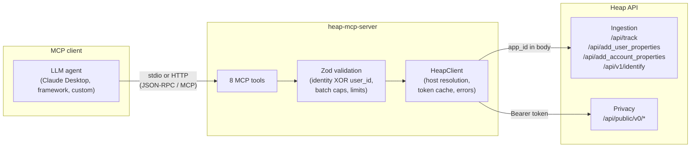
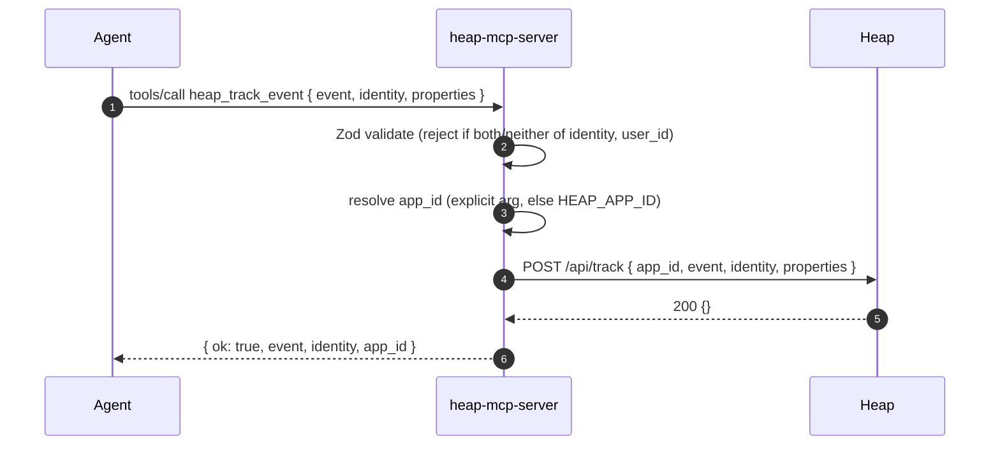
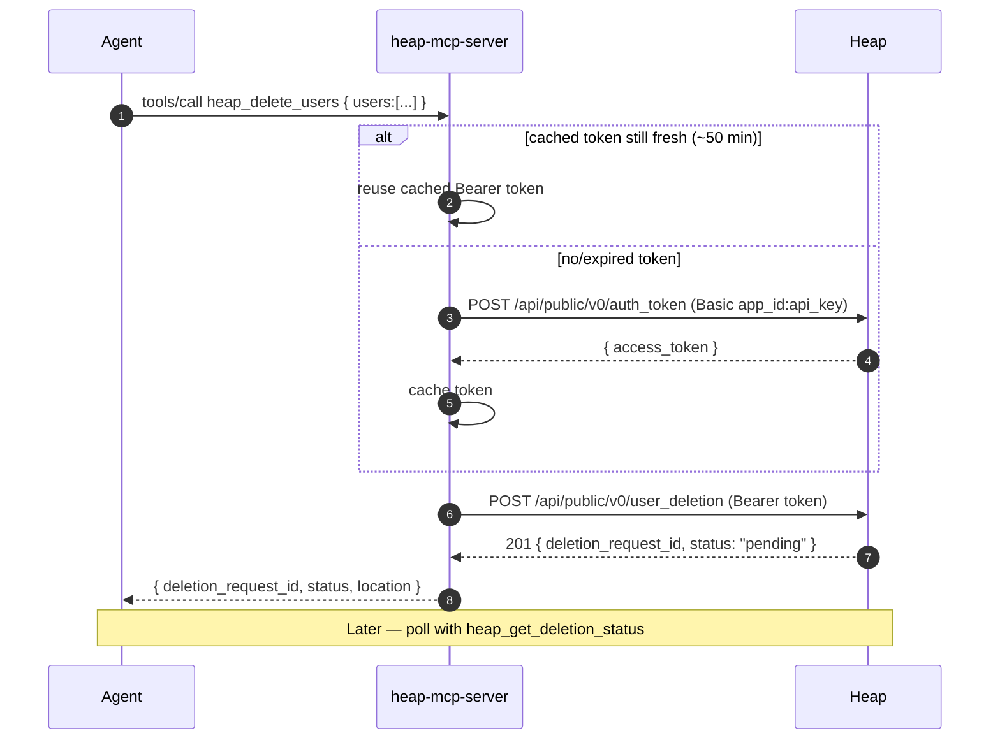

# Heap Analytics MCP Server

> A [Model Context Protocol](https://modelcontextprotocol.io) server that lets AI agents send events, enrich user/account profiles, resolve identities, and run GDPR deletions against [Heap Analytics](https://heap.io) (heap.io) — and, when you connect your [Heap Connect](https://help.heap.io) warehouse (BigQuery, Snowflake, Redshift), query your Heap data too.

<p>
  
  
  
  
  
  
</p>

`heap-mcp-server` exposes Heap's **server-side API** as a set of MCP tools. Point any MCP-compatible client (Claude Desktop, an agent framework, your own code) at it, and the model can log custom events, attach user and account properties, unify identities, and process user-deletion requests — all with validated inputs and actionable errors.

---

## Contents

- [Why use this](#why-use-this)
- [Scope: what it can and cannot do](#scope-what-it-can-and-cannot-do)
- [Capabilities](#capabilities)
- [How it works](#how-it-works)
- [Requirements](#requirements)
- [Quick start](#quick-start)
- [Configuration](#configuration)
- [Data vault sources (Heap Connect)](#data-vault-sources-heap-connect)
- [Usage](#usage)
- [Examples](#examples)
- [Rate limits](#rate-limits)
- [Error handling](#error-handling)
- [Security considerations](#security-considerations)
- [Project structure](#project-structure)
- [Development](#development)
- [Staying current with the Heap API](#staying-current-with-the-heap-api)
- [Publishing](#publishing)
- [Roadmap](#roadmap)
- [Contributing](#contributing)
- [License](#license)
- [Disclaimer](#disclaimer)

---

## Why use this

- **Write to Heap from anywhere an agent runs.** Backfill events, enrich profiles, or run deletions through natural-language tool calls instead of hand-rolling HTTP requests.
- **Read your Heap data too (optional).** Connect one or more Heap Connect warehouse destinations as named data sources — via the guided `setup_data` prompt — and the agent gains schema discovery, pageview/top-event/funnel/user queries, and guarded raw SQL.
- **Guardrails built in.** Heap's rules (one of `identity`/`user_id`, batch caps, identity-length limits) are enforced *before* any network call, so mistakes fail fast with clear messages.
- **Both transports.** Run locally over stdio for desktop clients, or as a stateless streamable-HTTP service for remote/multi-client use.
- **US & EU datacenters**, plus an optional base-URL override for proxies and gateways.

## Scope: what it can and cannot do

Heap's **public API is write-oriented.** There is no public REST query or reporting endpoint — Heap's data-*out* happens through [Heap Connect](https://help.heap.io) (a data-warehouse sync), not an API. So out of the box this server covers ingestion, enrichment, identity, and privacy operations — and if you use Heap Connect, you can register your warehouse(s) as **data vault sources** to unlock read/query tools as well.

| Always available | With a connected data source |
|---|---|
| Send custom events (single + bulk) | Discover the Heap Connect schema |
| Set user properties (single + bulk) | Query pageviews, top events, funnels |
| Set account properties (single + bulk) | Look up users & property values |
| Link anonymous `user_id` → `identity` | Run guarded ad-hoc SELECT queries |
| Submit & poll GDPR user deletions | Check Heap Connect sync freshness |

Query access requires [Heap Connect](https://help.heap.io) (a Heap add-on) syncing into a warehouse you control — BigQuery, Snowflake, or Redshift. See [Data vault sources](#data-vault-sources-heap-connect).

## Capabilities

Every tool accepts an optional `response_format` (`markdown` default, or `json`). Ingestion tools accept an optional `app_id` that overrides the configured default.

**Ingestion, identity & privacy (always registered):**

| Tool | Heap endpoint | Auth | Annotation |
|------|---------------|------|------------|
| `heap_track_event` | `POST /api/track` | `app_id` | write |
| `heap_bulk_track_events` (≤1000) | `POST /api/track` | `app_id` | write |
| `heap_add_user_properties` | `POST /api/add_user_properties` | `app_id` | write, idempotent |
| `heap_bulk_add_user_properties` (≤1000) | `POST /api/add_user_properties` | `app_id` | write, idempotent |
| `heap_add_account_properties` (single or bulk) | `POST /api/add_account_properties` | `app_id` | write, idempotent |
| `heap_identify_user` | `POST /api/v1/identify` | `app_id` | write, idempotent |
| `heap_delete_users` (≤10000) | `POST /api/public/v0/user_deletion` | API key | **destructive** |
| `heap_get_deletion_status` | `GET /api/public/v0/deletion_status/:id` | API key | read-only |

**Data vault sources (see [below](#data-vault-sources-heap-connect)):**

| Tool | Purpose | Registered |
|------|---------|------------|
| `heap_list_sources` | List configured sources (name, type, default, origin) | always |
| `heap_test_source` | Validate a source: connect → list tables → probe `_sync_history` | always |
| `heap_add_source` | Validate + persist a named source; unlocks query tools live | stdio (gated) |
| `heap_remove_source` | Remove a source from the sources file | stdio (gated) |
| `heap_describe_schema` | List tables or one table's columns | ≥1 source |
| `heap_query_pageviews` | Pageviews by URL path / day / user over a window | ≥1 source |
| `heap_query_top_events` | Rank events by count + unique users | ≥1 source |
| `heap_query_funnel` | 2–8 step conversion funnel with conversion window | ≥1 source |
| `heap_query_users` | Find users by identity, property, or performed event | ≥1 source |
| `heap_execute_query` | Guarded raw SQL (SELECT-only, LIMIT-clamped, 60 s timeout) | ≥1 source |
| `heap_get_sync_status` | Heap Connect `_sync_history` freshness | ≥1 source |

The server also registers one MCP **prompt**, `setup_data` — a guided setup flow that MCP clients surface as a slash command (in Claude Code: `/mcp__heap__setup_data`, where `heap` is your server key).

<details>
<summary><strong>Per-tool argument reference</strong></summary>

### `heap_track_event`
Send one custom server-side event.
- `event` (string, required) — event name, ≤1024 chars.
- `identity` **or** `user_id` (exactly one, required).
- `properties` (object, optional) — string/number/boolean or arrays thereof.
- `session_id`, `timestamp` (ISO8601), `idempotency_key` (optional).

### `heap_bulk_track_events`
Same as above, but `events` is an array (1–1000), each item carrying its own identity/properties.

### `heap_add_user_properties`
- `identity` (string, required), `properties` (object, required).
- Use a lowercase `email` key to write Heap's built-in Email property.

### `heap_bulk_add_user_properties`
- `users` — array (1–1000) of `{ identity, properties }`.

### `heap_add_account_properties`
- Single: `account_id` + `properties`. **Or** bulk: `accounts` array of `{ account_id, properties }`. Not both.
- Requires the Account ID setting (or Salesforce integration) configured in Heap.

### `heap_identify_user`
- `user_id` (numeric string from the SDK) + `identity` (both required), optional `timestamp`.

### `heap_delete_users`
- `users` — array (1–10000), each identified by exactly one of `user_id` or `identity`.
- Returns `deletion_request_id`, `status`, `deletion_request_location`.

### `heap_get_deletion_status`
- `deletion_request_id` (string, required). Returns `status` = `pending` | `complete`.

</details>

## How it works

### Architecture


```mermaid
flowchart LR
    subgraph client["MCP client"]
        agent["LLM agent<br/>(Claude Desktop, framework, custom)"]
    end

    subgraph server["heap-mcp-server"]
        direction TB
        tools["8 MCP tools"]
        zod["Zod validation<br/>(identity XOR user_id,<br/>batch caps, limits)"]
        hc["HeapClient<br/>(host resolution,<br/>token cache, errors)"]
        tools --> zod --> hc
    end

    subgraph heap["Heap API"]
        ing["Ingestion<br/>/api/track<br/>/api/add_user_properties<br/>/api/add_account_properties<br/>/api/v1/identify"]
        priv["Privacy<br/>/api/public/v0/*"]
    end

    agent -- "stdio or HTTP<br/>(JSON-RPC / MCP)" --> tools
    hc -- "app_id in body" --> ing
    hc -- "Bearer token" --> priv
```

### Ingestion request lifecycle


```mermaid
sequenceDiagram
    autonumber
    participant A as Agent
    participant S as heap-mcp-server
    participant H as Heap

    A->>S: tools/call heap_track_event { event, identity, properties }
    S->>S: Zod validate (reject if both/neither of identity, user_id)
    S->>S: resolve app_id (explicit arg, else HEAP_APP_ID)
    S->>H: POST /api/track { app_id, event, identity, properties }
    H-->>S: 200 {}
    S-->>A: { ok: true, event, identity, app_id }
```

### Deletion auth flow (Basic → cached Bearer)


```mermaid
sequenceDiagram
    autonumber
    participant A as Agent
    participant S as heap-mcp-server
    participant H as Heap

    A->>S: tools/call heap_delete_users { users:[...] }
    alt cached token still fresh (~50 min)
        S->>S: reuse cached Bearer token
    else no/expired token
        S->>H: POST /api/public/v0/auth_token  (Basic app_id:api_key)
        H-->>S: { access_token }
        S->>S: cache token
    end
    S->>H: POST /api/public/v0/user_deletion  (Bearer token)
    H-->>S: 201 { deletion_request_id, status: "pending" }
    S-->>A: { deletion_request_id, status, location }
    Note over A,H: Later — poll with heap_get_deletion_status
```

## Requirements

- **Node.js ≥ 18**
- A **Heap account** with an environment (app) ID. An **API key** is needed only for the deletion tools.
- An **MCP client** (e.g. Claude Desktop), or the [MCP Inspector](https://github.com/modelcontextprotocol/inspector) for testing.

## Quick start

Once published to npm, the fastest path is `npx` (no clone, no build):

```bash
HEAP_APP_ID=your_app_id npx heap-mcp-server
```

Or run from source:

```bash
git clone https://github.com/rivit-studio/heap-mcp-server.git
cd heap-mcp-server
npm install
npm run build

# run over stdio with your Heap environment ID
HEAP_APP_ID=your_app_id node dist/index.js
```

Then register it with your client (see [Usage](#usage)).

> **Installing from npm:** `npm install -g heap-mcp-server` exposes the `heap-mcp-server` command; or add it as a project dependency and invoke via `npx heap-mcp-server`.

## Configuration

All configuration is via environment variables. Copy `.env.example` to `.env` as a starting point.

| Variable | Required | Default | Description |
|----------|----------|---------|-------------|
| `HEAP_APP_ID` | Recommended | — | Default environment (app) ID. Without it, every call must pass `app_id`. |
| `HEAP_API_KEY` | Deletion only | — | Enables the deletion tools. For deletion, `HEAP_APP_ID` must be your **Main Production** environment ID. |
| `HEAP_DATA_CENTER` | No | `us` | `us` or `eu`. EU routes ingestion through `c.eu.heap-api.com`. |
| `HEAP_BASE_URL` | No | — | Override the Heap host (proxy/gateway). Applies to all endpoints. |
| `TRANSPORT` | No | `stdio` | `stdio` or `http`. |
| `PORT` | No | `3000` | Port for the `http` transport. |
| `HEAP_SOURCES_PATH` | No | `~/.heap-mcp/sources.json` | Where named data vault sources are stored. |
| `HEAP_ALLOW_SOURCE_ADMIN` | No | stdio: on, http: off | Force-enable (`true`) or disable (`false`) `heap_add_source`/`heap_remove_source`. |
| `HEAP_WAREHOUSE` | No | — | Legacy single-source config (`bigquery`\|`snowflake`\|`redshift`); loaded as a source named `default`. See below. |

**Where to find these in Heap:**
- Environment ID → **Account › Manage › Projects**
- API key → **Account › Manage › Privacy & Security** (admins can generate one)

## Data vault sources (Heap Connect)

Heap Connect syncs your Heap data (users, sessions, pageviews, `all_events`, one table per defined event, `_sync_history`) into a warehouse you control. Register those warehouses here as **named data sources** and the query tools light up. Heap can sync one environment to multiple destinations simultaneously — each becomes its own source, and query tools take an optional `source` argument (with a configurable default).

**Supported source types:** BigQuery (Google Cloud), Redshift (AWS), Snowflake. The driver registry is built for Heap's other Connect destinations (Databricks, S3) to be added as future drivers.

### The `setup data` slash command

The easiest path is the built-in `setup_data` MCP prompt — in Claude Code, type `/mcp__heap__setup_data` (your server key may differ). It inspects current state, asks which warehouse you use, collects the connection config (steering secrets toward `${ENV_VAR}` references), validates the connection end to end via `heap_add_source`, and reports which query tools just became available — no restart needed (the server emits `tools/list_changed`).

### The sources file

Sources persist in `~/.heap-mcp/sources.json` (override with `HEAP_SOURCES_PATH`; written `0600`):

```jsonc
{
  "version": 1,
  "default_source": "prod_sf",
  "sources": {
    "prod_sf": {
      "type": "snowflake",
      "account": "xy12345.us-east-1",
      "username": "heap_user",
      "password": "${HEAP_SF_PASSWORD}",   // resolved from the env at connect time
      "database": "HEAP_DB",
      "warehouse": "COMPUTE_WH",
      "schema": "heap"
    },
    "bq": { "type": "bigquery", "project": "my-gcp-project", "dataset": "heap" },
    "rs": {
      "type": "redshift",
      "host": "my-cluster.abc.us-east-1.redshift.amazonaws.com",
      "database": "analytics",
      "user": "heap_user",
      "password": "${HEAP_RS_PASSWORD}",
      "schema": "heap"
    }
  }
}
```

Secret fields accept `${ENV_VAR}` references — recommended, so credentials stay in your MCP client's `env` block instead of on disk. Literal values work too (the file is `0600`, but prefer references). BigQuery with neither `credentials` nor `credentials_file` uses Application Default Credentials.

### Warehouse SDK installation

Warehouse SDKs are **optional peer dependencies** — ingestion-only installs stay light. Install only the driver(s) you need next to the server:

| Source type | Package |
|---|---|
| `bigquery` | `@google-cloud/bigquery` |
| `snowflake` | `snowflake-sdk` |
| `redshift` | `pg` |

With global installs: `npm install -g heap-mcp-server @google-cloud/bigquery`. With bare `npx`, put the driver on the path too: `npx -y -p heap-mcp-server -p @google-cloud/bigquery heap-mcp-server`. A missing driver fails with the exact install command.

### Legacy single-source env config

The pre-1.1 env-var design still works: set `HEAP_WAREHOUSE=bigquery|snowflake|redshift` plus its vars (`HEAP_BQ_PROJECT`, `HEAP_BQ_DATASET`, `HEAP_BQ_CREDENTIALS`; `HEAP_SF_ACCOUNT`, `HEAP_SF_USERNAME`, `HEAP_SF_PASSWORD`, `HEAP_SF_DATABASE`, `HEAP_SF_SCHEMA`, `HEAP_SF_WAREHOUSE`; `HEAP_RS_HOST`, `HEAP_RS_PORT`, `HEAP_RS_DATABASE`, `HEAP_RS_SCHEMA`, `HEAP_RS_USER`, `HEAP_RS_PASSWORD`) and it loads as a source named `default`. A file-defined source of the same name takes precedence.

### Notes

- **Schema drift:** Heap Connect's schema is dynamic. The event-name column defaults to `event_view_name` and the pageview path column to `path`; both are overridable per call (`event_column`, `url_column`) if your sync differs.
- **HTTP transport:** `heap_add_source`/`heap_remove_source` are disabled by default under `TRANSPORT=http` (the endpoint is unauthenticated); configure sources via the file instead, which each request re-reads. Clients that don't handle `tools/list_changed` see the query tools on reconnect.

## Usage

### stdio (local desktop clients)

```bash
HEAP_APP_ID=your_app_id node dist/index.js
```

Claude Desktop config (`claude_desktop_config.json`):

```json
{
  "mcpServers": {
    "heap": {
      "command": "node",
      "args": ["/absolute/path/to/heap-mcp-server/dist/index.js"],
      "env": {
        "HEAP_APP_ID": "your_app_id",
        "HEAP_API_KEY": "only_if_using_deletion",
        "HEAP_DATA_CENTER": "us"
      }
    }
  }
}
```

### HTTP (remote / multiple clients)

```bash
HEAP_APP_ID=your_app_id TRANSPORT=http PORT=3000 node dist/index.js
```

- MCP endpoint: `POST http://localhost:3000/mcp`
- Health check: `GET http://localhost:3000/health`

The HTTP transport is **stateless** — a fresh server + transport is created per request, which avoids request-ID collisions and scales cleanly behind a load balancer.

### Docker (HTTP transport)

A multi-stage `Dockerfile` is included. The image builds the TypeScript, installs only production dependencies, runs as a non-root user, and ships with a `/health` healthcheck. It defaults to the HTTP transport.

```bash
docker build -t heap-mcp-server .

docker run --rm -p 3000:3000 \
  -e HEAP_APP_ID=your_app_id \
  -e HEAP_API_KEY=only_if_using_deletion \
  -e HEAP_DATA_CENTER=us \
  heap-mcp-server
```

- MCP endpoint: `POST http://localhost:3000/mcp`
- Health check: `GET http://localhost:3000/health`

> The HTTP transport ships without authentication — see [Security considerations](#security-considerations) before exposing the container beyond localhost.

### Inspect interactively

```bash
npx @modelcontextprotocol/inspector node dist/index.js
```

## Examples

These are natural-language prompts an agent might receive and the resulting tool call.

**Track a purchase**
> "Log a `Purchase` event for `alice@example.com` with amount 42 and plan pro."

```json
{
  "name": "heap_track_event",
  "arguments": {
    "event": "Purchase",
    "identity": "alice@example.com",
    "properties": { "amount": 42, "plan": "pro" }
  }
}
```

**Enrich an account for account-health analysis**
> "Set tier=Enterprise and mrr=12000 on account `Acme Corp`."

```json
{
  "name": "heap_add_account_properties",
  "arguments": {
    "account_id": "Acme Corp",
    "properties": { "tier": "Enterprise", "mrr": 12000 }
  }
}
```

**Unify an anonymous visitor with a known user**
> "Identify SDK user 1847839267195673 as bob@example.com."

```json
{
  "name": "heap_identify_user",
  "arguments": { "user_id": "1847839267195673", "identity": "bob@example.com" }
}
```

**Run a GDPR deletion, then check status**
> "Delete the Heap user gone@example.com, then tell me the request status."

```json
{ "name": "heap_delete_users", "arguments": { "users": [{ "identity": "gone@example.com" }] } }
```
```json
{ "name": "heap_get_deletion_status", "arguments": { "deletion_request_id": "c93fae81-..." } }
```

**Query the warehouse (requires a connected data source)**
> "What were my top 10 events last week, excluding pageviews?"

```json
{
  "name": "heap_query_top_events",
  "arguments": {
    "start_time": "2026-08-03",
    "end_time": "2026-08-10",
    "limit": 10,
    "exclude_pageviews": true
  }
}
```

> "Funnel from sign_up to created_project to invited_teammate this month, on the bq source."

```json
{
  "name": "heap_query_funnel",
  "arguments": {
    "source": "bq",
    "steps": ["sign_up", "created_project", "invited_teammate"],
    "start_time": "2026-08-01",
    "end_time": "2026-08-31"
  }
}
```

## Rate limits

Enforced by Heap (the server surfaces a clear message on `429`):

- **Single track / property calls:** 30 requests / 30 s per identity per `app_id`.
- **Bulk track:** 1000 events / min / identity and 15,000 events / min / `app_id`.
- **Identify:** 1 identity per `user_id`; up to 10 `user_id`s per identity per month. Excess mappings are silently dropped by Heap.

Prefer the bulk tools for backfills to stay within limits.

## Error handling

Failures are normalized into actionable messages with structured content, so an agent can react:

| Condition | What you get |
|---|---|
| Invalid input (e.g. both `identity` and `user_id`) | Validation error *before* any request, naming the exact rule |
| `400` from Heap | "Bad request… check required fields and identity/user_id" + Heap's detail |
| `401` | Hint to verify `HEAP_APP_ID` (Main Production) and `HEAP_API_KEY` |
| `404` (status lookup) | Hint that the `deletion_request_id` may not exist for this env |
| `429` | Rate-limit explanation with the relevant limits |
| Network / timeout | Connection guidance |

## Security considerations

- **Secrets live in env vars, never in code or logs.** The server logs only *whether* `HEAP_APP_ID`/`HEAP_API_KEY` are set, never their values.
- **The API key unlocks irreversible deletion.** Scope it tightly and prefer running deletion workflows in a controlled environment. `heap_delete_users` is annotated `destructive` so clients can gate it behind confirmation.
- **The HTTP transport ships without auth.** If you expose it beyond localhost, put it behind your own authentication/authorization (reverse proxy, gateway, network policy). Treat `/mcp` as privileged. `heap_add_source`/`heap_remove_source` are disabled by default under `TRANSPORT=http` so a network caller can't write host files or point the server at arbitrary databases (`HEAP_ALLOW_SOURCE_ADMIN` overrides).
- **Warehouse credentials.** Prefer `${ENV_VAR}` references in the sources file so secrets stay in the environment; literal values are stored `0600` and never echoed back by tools (masked in output). Use a read-only warehouse user scoped to the Heap schema — the query tools are read-only (`SELECT`-only guardrails), and a least-privilege grant makes that defense-in-depth.
- **PII flows through this server.** Identities and properties may contain personal data; handle transport and hosting accordingly.

To report a vulnerability, see **[SECURITY.md](SECURITY.md)** — please use private disclosure, not a public issue.

## Project structure

```
heap-mcp-server/
├── src/
│   ├── index.ts               # entry point: transports + server wiring
│   ├── constants.ts           # datacenter hosts, limits, config resolution
│   ├── types.ts               # shared types
│   ├── schemas.ts             # Zod input schemas (validation rules)
│   ├── config/
│   │   └── sources.ts          # sources file load/save, env layering, ${VAR} refs
│   ├── prompts/
│   │   └── setupData.ts        # the setup_data guided-setup prompt
│   ├── services/
│   │   ├── heapClient.ts       # HTTP client, auth-token caching, error normalization
│   │   └── warehouse/
│   │       ├── types.ts        # SourceDriver interface, WarehouseError, dialects
│   │       ├── registry.ts     # named-source registry, lazy driver loading
│   │       ├── sqlBuilders.ts  # pure dialect-aware SQL generation + guardrails
│   │       └── drivers/        # bigquery.ts, snowflake.ts, redshift.ts, fake.ts
│   └── tools/
│       ├── tracking.ts         # heap_track_event, heap_bulk_track_events
│       ├── properties.ts       # user + account property tools
│       ├── identity.ts         # heap_identify_user
│       ├── deletion.ts         # heap_delete_users, heap_get_deletion_status
│       ├── sources.ts          # heap_list/test/add/remove_source
│       ├── query.ts            # the 7 warehouse query tools
│       └── helpers.ts          # shared response builders
├── test/
│   ├── schemas.test.mjs        # unit tests for validation rules
│   ├── integration.test.mjs    # mock-server integration tests
│   ├── sources-config.test.mjs # sources file, layering, interpolation
│   ├── sql-builders.test.mjs   # SQL generation + raw-SQL guardrails
│   ├── warehouse-integration.test.mjs  # fake-driver end-to-end over stdio
│   └── warehouse-live.test.mjs # real drivers (skipped without credentials)
├── scripts/
│   └── check-heap-api.mjs      # Heap API drift checker
├── .heap-api-snapshots/        # committed baseline of Heap's OpenAPI specs
├── .github/
│   ├── workflows/
│   │   ├── ci.yml              # build + test (Node 18/20/22) and Docker build
│   │   ├── publish.yml         # npm publish on GitHub Release
│   │   └── heap-api-watch.yml  # scheduled Heap API drift check -> issue
│   ├── ISSUE_TEMPLATE/         # bug report, feature request, chooser config
│   ├── pull_request_template.md
│   └── dependabot.yml          # weekly npm / actions / docker updates
├── Dockerfile                  # multi-stage build, HTTP transport
├── .dockerignore
├── .gitignore
├── .env.example
├── CONTRIBUTING.md
├── SECURITY.md
├── LICENSE
├── package.json
├── tsconfig.json
└── README.md
```

## Development

```bash
npm install        # install deps
npm run build      # compile TypeScript -> dist/
npm run dev        # watch mode (tsx)
npm run clean      # remove dist/
npm start          # run the built server
npm test           # build, then run all tests
npm run check:heap-api  # check Heap's API for drift vs committed snapshots
```

The codebase is strict TypeScript (no `any`), with validation centralized in `schemas.ts` and all HTTP/auth/error logic in `services/heapClient.ts`. Tools stay thin and compose those.

### Testing

Tests use Node's built-in runner (`node:test`) — no extra framework or dependencies.

```bash
npm test           # builds first, then runs the suite
npm run test:only  # run tests against the existing build (skip rebuild)
```

- **Unit** (`test/schemas.test.mjs`) — assert the Zod schemas accept valid input and reject invalid input (identity/user_id rule, batch caps, strictness, length limits).
- **Integration** (`test/integration.test.mjs`) — start a local mock HTTP server, run the built server over stdio with `HEAP_BASE_URL` pointed at the mock, drive tools through the MCP protocol, and assert the exact requests Heap would receive (endpoints, bodies, and the Basic→Bearer auth flow plus token caching).
- **Sources config** (`test/sources-config.test.mjs`) — sources-file parsing, `${ENV_VAR}` interpolation, legacy `HEAP_WAREHOUSE` migration, file/env layering, atomic save/remove.
- **SQL builders** (`test/sql-builders.test.mjs`) — dialect-correct SQL for every query tool, plus the raw-SQL guardrails (SELECT-only, single statement, LIMIT clamping).
- **Warehouse integration** (`test/warehouse-integration.test.mjs`) — the built server over stdio with fake sources (`HEAP_ENABLE_FAKE_DRIVER=1`): tool registration, per-source routing, runtime `heap_add_source` + `tools/list_changed`, admin gating, and the `setup_data` prompt.
- **Live drivers** (`test/warehouse-live.test.mjs`) — real BigQuery/Snowflake/Redshift connections; skipped unless `HEAP_TEST_BQ_*`/`HEAP_TEST_SF_*`/`HEAP_TEST_RS_*` credentials are present.

Because the integration tests use a local mock and the fake driver, they never touch a real Heap workspace or warehouse and need no credentials.

**Continuous integration.** `.github/workflows/ci.yml` runs the build and test suite on Node 18, 20, and 22, and builds the Docker image, on every push and pull request to `main`.

## Staying current with the Heap API

Because this server mirrors Heap's server-side endpoints, it can fall out of date if Heap changes them. The repo guards against silent drift:

- **Snapshots.** `.heap-api-snapshots/` holds a committed baseline of the embedded OpenAPI definitions (and normalized text) for every Heap reference page the tools depend on.
- **Checker.** `npm run check:heap-api` re-fetches those pages, normalizes them, and diffs against the baseline. It exits non-zero and writes `heap-api-diff.md` if anything changed.
- **Scheduled watch.** `.github/workflows/heap-api-watch.yml` runs the checker every Monday (and on demand). On drift it opens — or comments on — an issue labeled `heap-api-drift` with the diff, so maintainers get notified without any external service.

When a change is real and intended, review the affected tools/schemas, then refresh the baseline:

```bash
npm run check:heap-api -- --update
git add .heap-api-snapshots && git commit -m "chore: refresh Heap API snapshots"
```

Dependencies are likewise kept current by **Dependabot** (`.github/dependabot.yml`) across npm, GitHub Actions, and the Dockerfile.

## Publishing

Releases publish to npm automatically via `.github/workflows/publish.yml` when a GitHub Release is published. Set an `NPM_TOKEN` repository secret (an npm automation token with publish rights) first. The workflow builds, tests, and runs `npm publish --provenance --access public`. Bump the version in `package.json` before tagging the release.

## Roadmap

Ideas and PRs welcome:

- [x] Automated test suite (unit + mock-server integration)
- [x] `Dockerfile` and container image for the HTTP transport
- [x] CI workflow (build + test on PRs)
- [x] npm publish workflow + `npx` entry point
- [x] Heap API drift monitoring
- [x] Data vault sources: multi-warehouse Heap Connect queries (BigQuery, Snowflake, Redshift) + `setup_data` guided setup
- [ ] Databricks and S3 Heap Connect drivers (registry is ready for them)
- [ ] Optional auth middleware for the HTTP transport
- [ ] MCP evaluation suite

## Contributing

Contributions are welcome — see **[CONTRIBUTING.md](CONTRIBUTING.md)** for setup, conventions, and the PR process. In short:

1. Open an issue describing the change or bug.
2. Fork, branch, and make your change. Keep tools thin; put shared logic in `services/` and validation in `schemas.ts`.
3. Run `npm test` (build + tests must pass) and verify behavior with the MCP Inspector.
4. Open a PR with a clear description and, where relevant, before/after notes.

Keep new tools consistent with the existing patterns: snake_case `heap_*` names, full descriptions with `Args:` / `Returns:` / `Example:`, correct annotations (`readOnlyHint`/`destructiveHint`/`idempotentHint`), and `.strict()` Zod schemas.

## License

Released under the **MIT License** — see [LICENSE](LICENSE). The license file ships with a placeholder copyright line (`<YOUR NAME OR ORGANIZATION>`); update it with your name/organization before publishing.

## Disclaimer

This is an **unofficial, community-maintained** project. It is not affiliated with, endorsed by, or supported by Heap or Contentsquare. "Heap" is a trademark of its respective owner. Verify behavior against the [official Heap API docs](https://developers.heap.io) before relying on it in production.
